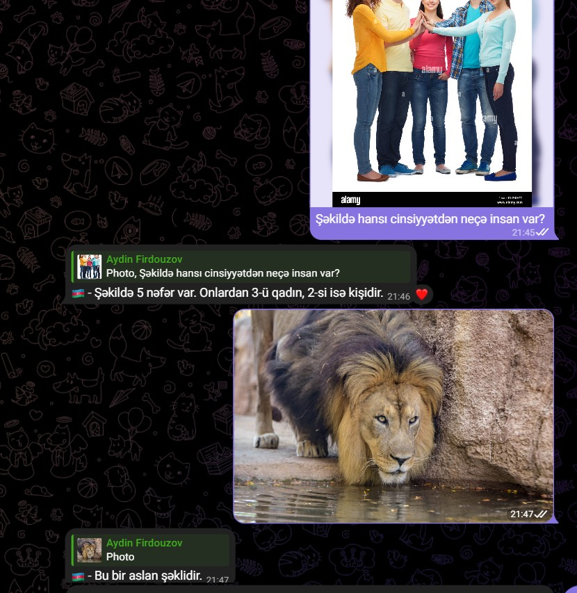

<!-- PROJECT LOGO -->
<br />
<div align="center">
  <a href="">
    
  </a>

  <h3 align="center">Danishan Bot</h3>

  <p align="center">
    Gemini Pro and Gemini Vision Pro supported telegram Bot!
  </p>
</div>


<!-- TABLE OF CONTENTS -->
<details>
  <summary>Table of Contents</summary>
  <ol>
    <li>
      <a href="#about-the-project">About The Project</a>
      <ul>
        <li><a href="#Gemini-Api">Gemini API</a></li>
      </ul>
    </li>
    <li>
      <a href="#deployment">Deployment</a>
    </li>
    <li><a href="#usage">Usage</a></li>
    <li><a href="#roadmap">Contact</a></li>
  </ol>
</details>


<!-- Danishan Bot -->
## About the Project

**Danishan Bot** is the telegram bot that can detect and speak with your 
language as answer questions over text and image content, describe pictures 
as you like. Bot is supported by Gemini Pro and Gemini Vision Pro models.


Here's why Danishan should be used:
* Gemini is not available for some countries like Azerbaijan etc.. Using this bot You can access Gemini from anywhere you are
* Gemini doesn't have large trainable data in terms of some languages. The bot firstly detect your language and translate it
to English then create content in your language
* You can use it with mobile device more easily compared to Gemini itself


<!-- Gemini API -->
## Gemini API

It uses an api from [Gemini Quickstart for Python](https://ai.google.dev/tutorials/python_quickstart). 
</br>You can read api docs from the link 
Here's the link you can get your API [Gemini API](https://aistudio.google.com/app/apikey)

Download library Google GenerativeAI library using pip installer

```sh
   pip install google-generativeai
   ```

<!-- Gemini API -->
## Deployment

In order to deploy the bot, [PythonAnywhere](https://www.pythonanywhere.com/) is used as hosting server


<!-- DEMO -->
## Usage
⚡How to use Danishan Bot :
1) You can send any text content and I will reply with the language I receive.
2) You can send image and caption any specific task and I will reply with the language I receive also.
3)You can send image without any caption and I will reply back with the description of image.

If the image has not any caption I will reply back with the last language you used. If any language is not recognized yet, by default I will reply with English. 

<a href="" align="left">
    
  </a>
<a href="" align="right">
    
  </a>

<p align="right">(<a href="#readme-top">back to top</a>)</p>


<!-- CONTACT -->
## Contact

Aydin Firdouzov - [Linkedin](https://linkedin.com/in/firdouzov) - aydin.firdouzov@gmail.com

Project Link: [Danishan Bot](https://github.com/firdouzov/danishan_bot)

<p align="right">(<a href="#readme-top">back to top</a>)</p>

